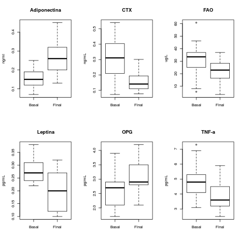
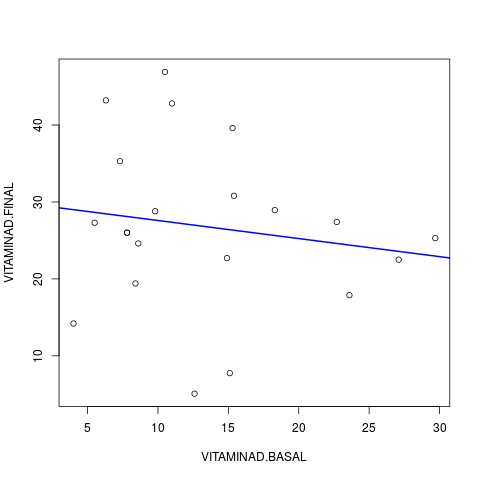
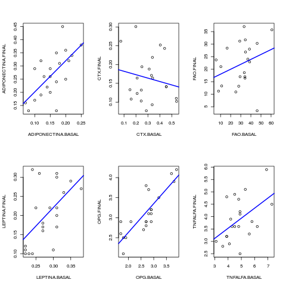

# Metodologia utilizada

A análise descritiva foi apresentada na forma de tabelas os dados observados, expressos pela média, desvio padrão, mediana, amplitude interquartílica (AIQ), mínimo e máximo para dados numéricos (quantitativos) e pela frequência (n) e percentual (%) para dados categóricos (qualitativos). São apresentados gráficos descritivos das variáveis basais e finais. Ao longo do texto, as variáveis normais foram sumarizadas como média +/ desvio padrão (DP), e as variáveis não normais como mediana +- AIQ.

Foi aplicado o teste de normalidade de Shapiro-Wilks nas variáveis numéricas. A comparação das variáveis basais e finais foi feita com o teste t pareado para variáveis normalmente distribuídas, e com o teste de Mann-Whitney pareado para variáveis que tiveram a hipótese de normalidade rejeitada. Foram calculadas as correlações entre o nível final de Vitamina D e o nível final de cada marcador. Para variáveis normais, foi aplicada a correlação de Pearson, e para variáveis não normais, a correlação não paramétrica de Spearman. Em todas as análises, foi adotada a  significância de 5%. As análises estatística foram feitas utilizando o software estatístico R, versão 3.2.2 (https://www.R-project.org).

# Resultados

## Estatísticas descritivas

### Estatísticas
```{r, echo=FALSE}
# library(knitr)

```

```{r, echo=FALSE}
# set pander table-layout options
library(pander)
panderOptions('table.alignment.default', function(df)
    ifelse(sapply(df, is.numeric), 'right', 'left'))
panderOptions('table.split.table', Inf)
panderOptions('table.split.cells', Inf)
# panderOptions('digits', 5)
panderOptions('keep.trailing.zeros', TRUE)
```

```{r, results='asis', echo=FALSE}
desc.num <- read.table("../resultados/descritivas.dat")
# kable(desc.num)
# knitr::kable(desc.num)
pander(desc.num)
```

Tabela 1: Estatísticas descritivas da vitamina D e marcadores (siglas), em média (DP), mediana (AIQ).

As estatísticas descritivas das variáveis analisadas estão sumarizadas na tabela

### Gráficos


Figura 1: Níveis basal e final da Vitamina D (boxplot: mediana, quartis, outlier)



Figura 2: Níveis basal e final dos marcadores ADP, CTX, FAO, LEP, OPG e TNF (siglas e boxplot: mediana, quartis, outliers)

São apresentadas nas figuras 3 e 4 as retas de melhor ajuste aos ...

Os níveis basal e final foram significativamente diferentes, conforme seção X, e resumidos na tabela X.



Figura 3: Comparação entre a Vitamina D basal e final (completar legenda). Índice de correlação de Spearman: -0.1241066 (p-valor=0.592)

Sugestão: **não incluir a figura acima, da reta de melhor ajuste da vitamina D**. Incluir no trabalho apenas as figuras 1 e 2 que ilustram a diferença entre os níveis basal e final, e a figura abaixo, com os dados e a reta de melhor ajuste dos marcadores.



Figura 4: Comparação entre os níveis basal e final dos marcadores ADP, CTX, FAO, LEP, OPG e TNF (completar, siglas, etc). A linha azul é a reta de melhor ajuste aos dados. Índices de correlação de Spearman: ADP (rho=0.6564454, p-valor=0.001229), CTX (rho=-0.1102081, p-valor=0.6344), FAO (rho=0.3164392, p-valor=0.1623), LEP (rho=0.547378, p-valor=0.01022), OPG (rho=0.8328939, p-valor=2.791e-06) e TNF (rho=0.464204, p-valor=0.03402).

## Normalidade

Considerando conjuntamente os valores basal e final, nenhuma das variáveis parece ter distribuição normal. Deve-se rejeitar a hipótese de normalidade de **todas** as variáveis, e utilizar apenas métodos e testes não paramétricos. Tabela 2.

```{r, results='asis', echo=FALSE}
np <- read.table("../resultados/norm.dat")
# knitr::kable(np,digits=5)
pander(np)
```

Tabela 2: Testes de normalidade dos níveis basal e final da Vitamina D e dos marcadores ADP, CTX, FAO, LEP, OPG e TNF (completar, siglas, etc). P-valores apresentados para o teste de Shapiro-Wilks.

## Testes pareados

Todos os testes pareados indicaram aumento/diminuição altamente significativa entre o valor basal e final de cada variável. Tabela 3.

```{r, results='asis', echo=FALSE}
diferencas <- read.table("../resultados/diferencas.dat")
# knitr::kable(diferencas)
# knitr::kable(diferencas, format.args=list(scientific=-2))
# knitr::kable(diferencas,digits=5)
pander(diferencas)
```

Tabela 3: Diferenças entre os valores basal e final dos marcadores ADP, CTX, FAO, LEP, OPG e TNF (siglas). P-valores apresentados de acordo com o teste de Mann-Whitney pareado.

## Correlações

Nenhuma das correlações entre Vitamina D e marcadores foi significativa com os dados analisados. Tabela 4

```{r, results='asis', echo=FALSE}
ct <- read.table("../resultados/cortest.dat")
# knitr::kable(ct,digits=5)
pander(ct)
```

Tabela 4: Coeficientes de correlação de Spearman entre o nível final de Vitamina D e o nível final dos marcadores ADP, CTX, FAO, LEP, OPG e TNF (siglas).

# Conclusões sintéticas

- Nenhuma das variáveis parece ser normalmente distribuída (Tabela 2). Foram utilizados testes não-paramétricos.
- Todas as diferenças entre o nível basal e final foram altamente significativas (Tabela 3)
- Nenhuma correlação entre a Vitamina D e os marcadores foi significativa (Tabela 4)
- Algumas correlações entre o nível basal e final foram significativas (Figura 4)

A maior parte das correlações não foram significativas, no entanto os testes de diferença foram altamente significativos. Isso pode ser observado quando a correlação discorda da diferença. Por exemplo, FAO tem correlação positiva (rho=0.3164392), embora seu nível final tenha sido significativamente **menor** que o nível basal (p-valor=0.008773), o que pode ser observado na Figura 2.

Minha sugestão é evitar discutir os valores de correlação mas apenas apresentar os resultados, indicando que não são significativos.

Possíveis justificativas para estas observações incluem:

- poucos dados
- outliers que possivelmente deveriam ser removidos

Observe que com tão poucos casos, remover outliers possivelmente tornaria a maior parte das análises inconcludentes. Lembre-se que este trabalho é um estudo de caso, e portanto tudo que foi observado pode e deve ser reportado como tal, sem garantias de generalidade.
