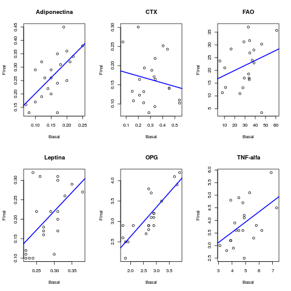

# Metodologia utilizada

A análise descritiva foi apresentada na forma de tabelas os dados observados, expressos pela média, desvio padrão, mediana, amplitude interquartílica (AIQ), mínimo e máximo para dados numéricos (quantitativos) e pela frequência (n) e percentual (\%) para dados categóricos (qualitativos). São apresentados gráficos descritivos das variáveis basais e finais. Ao longo do texto, as variáveis normais foram sumarizadas como média +/ desvio-padrão (DP), e as variáveis não-normais como mediana +- AIQ.

Foi aplicado o teste de normalidade de Shapiro-Wilks nas variáveis numéricas. A comparação das variáveis basais e finais foi feita com o teste t pareado para variáveis normalmente distribuídas,  e com o teste de Mann-Whitney pareado para variáveis que tiveram a hipótese de normalidade rejeitada. Em todas as análises, foi adotada a  significância de 5%. As análises estatística foram feitas utilizando o software estatístico R, versão 3.2.2 (https://www.R-project.org).

# Resultados

## Estatísticas descritivas

### Estatísticas

Variável | Média (DP) | Mediana (AIQ)
---| --- | ---
Vitamina D basal | x | x
Vitamina D final | x | x
ADP basal | x | x
ADP final | x | x
CTX basal | x | x
CTX final | x | x
FAO basal | x | x
FAO final | x | x
LEP basal | x | x
LEP final | x | x
OPG basal | x | x
OPG final | x | x
TNF basal | x | x
TNF final | x | x

Tabela 1: Estatísticas descritivas da vitamina D e marcadores (siglas), em média (DP), mediana (AIQ).

As estatísticas descritivas das variáveis analisadas estão sumarizadas na tabela

### Gráficos

Figura 1: Níveis basal e final da Vitamina D (boxplot: mediana, quartis, outliers)

Figura 2: Níveis basal e final dos marcadores ADP, CTX, FAO, LEP, OPG e TNF (siglas e boxplot: mediana, quartis, outliers)

São apresentadas nas figuras 3 e 4 as retas de melhor ajuste aos ...

Os níveis basal e final foram significativamente diferentes, conforme seção X, e resumidos na tabela X.

Figura 3: Comparação entre a Vitamina D basal e final (completar legenda)

Figura 4: Comparação entre os níveis basal e final dos marcadores ADP, CTX, FAO, LEP, OPG e TNF (completar, siglas, etc). A linha azul é a reta de melhor ajuste aos dados. Índices de correlação de Pearson/Spearman: ADP (r=), CTX (r=), FAO (r=), LEP (r=), OPG (r=) e TNF (r=). (Incluir correlações)

## Normalidade

- P: textual ou tabela?

Considerando conjuntamente os valores basal e final, nenhuma das variáveis parece ter distribuição normal.

## Testes pareados

Variável | Valor basal mediano (AIQ)  | Valor final mediano (AIQ)  | p-valor
--- | --- | --- | ---
ADP |x | x |x
CTX |x |x |x
FAO |x |x |x
LEP |x |x |x
OPG |x |x |x
TNF |x |x |x

Tabela 2: Diferenças entre os valores basal e final dos marcadores. Siglas... (terminar). Mann-Whitney pareado

Ouro (todos os p-valores são significativos para os resultados abaixo):

- Vitamina D aumentou
- ADP aumentou
- CTX diminuiu
- FAO diminuiu
- LEP diminuiu
- OPG aumentou
- TNF diminuiu

