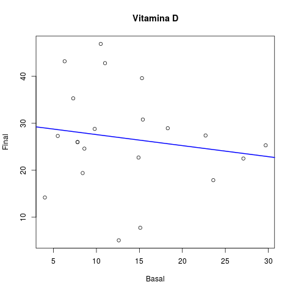

Metodologia utilizada
=====================

A análise descritiva foi apresentada na forma de tabelas os dados observados, expressos pela média, desvio padrão, mediana, amplitude interquartílica (AIQ), mínimo e máximo para dados numéricos (quantitativos) e pela frequência (n) e percentual (%) para dados categóricos (qualitativos). São apresentados gráficos descritivos das variáveis basais e finais. Ao longo do texto, as variáveis normais foram sumarizadas como média +/ desvio padrão (DP), e as variáveis não normais como mediana +- AIQ.

Foi aplicado o teste de normalidade de Shapiro-Wilks nas variáveis numéricas. A comparação das variáveis basais e finais foi feita com o teste t pareado para variáveis normalmente distribuídas, e com o teste de Mann-Whitney pareado para variáveis que tiveram a hipótese de normalidade rejeitada. Foram calculadas as correlações entre o nível final de Vitamina D e o nível final de cada marcador. Para variáveis normais, foi aplicada a correlação de Pearson, e para variáveis não normais, a correlação não paramétrica de Spearman. Em todas as análises, foi adotada a significância de 5%. As análises estatística foram feitas utilizando o software estatístico R, versão 3.2.2 (<https://www.R-project.org>).

Resultados
==========

Estatísticas descritivas
------------------------

### Estatísticas

<table>
<colgroup>
<col width="34%" />
<col width="11%" />
<col width="8%" />
<col width="13%" />
<col width="6%" />
</colgroup>
<thead>
<tr class="header">
<th align="center"> </th>
<th align="right">Média</th>
<th align="right">DP</th>
<th align="right">Mediana</th>
<th align="right">AIQ</th>
</tr>
</thead>
<tbody>
<tr class="odd">
<td align="center"><strong>VITAMINAD.BASAL</strong></td>
<td align="right">13.41</td>
<td align="right">7.27</td>
<td align="right">11</td>
<td align="right">7.6</td>
</tr>
<tr class="even">
<td align="center"><strong>VITAMINAD.FINAL</strong></td>
<td align="right">26.78</td>
<td align="right">10.87</td>
<td align="right">26</td>
<td align="right">8.3</td>
</tr>
<tr class="odd">
<td align="center"><strong>ADIPONECTINA.BASAL</strong></td>
<td align="right">0.16</td>
<td align="right">0.05</td>
<td align="right">0.15</td>
<td align="right">0.07</td>
</tr>
<tr class="even">
<td align="center"><strong>ADIPONECTINA.FINAL</strong></td>
<td align="right">0.27</td>
<td align="right">0.09</td>
<td align="right">0.26</td>
<td align="right">0.12</td>
</tr>
<tr class="odd">
<td align="center"><strong>CTX.BASAL</strong></td>
<td align="right">0.31</td>
<td align="right">0.13</td>
<td align="right">0.31</td>
<td align="right">0.19</td>
</tr>
<tr class="even">
<td align="center"><strong>CTX.FINAL</strong></td>
<td align="right">0.16</td>
<td align="right">0.06</td>
<td align="right">0.14</td>
<td align="right">0.08</td>
</tr>
<tr class="odd">
<td align="center"><strong>FAO.BASAL</strong></td>
<td align="right">30.23</td>
<td align="right">13.8</td>
<td align="right">33.5</td>
<td align="right">11.9</td>
</tr>
<tr class="even">
<td align="center"><strong>FAO.FINAL</strong></td>
<td align="right">21.99</td>
<td align="right">8.95</td>
<td align="right">22.9</td>
<td align="right">12</td>
</tr>
<tr class="odd">
<td align="center"><strong>LEPTINA.BASAL</strong></td>
<td align="right">0.28</td>
<td align="right">0.04</td>
<td align="right">0.27</td>
<td align="right">0.07</td>
</tr>
<tr class="even">
<td align="center"><strong>LEPTINA.FINAL</strong></td>
<td align="right">0.2</td>
<td align="right">0.08</td>
<td align="right">0.2</td>
<td align="right">0.15</td>
</tr>
<tr class="odd">
<td align="center"><strong>OPG.BASAL</strong></td>
<td align="right">2.68</td>
<td align="right">0.66</td>
<td align="right">2.7</td>
<td align="right">0.8</td>
</tr>
<tr class="even">
<td align="center"><strong>OPG.FINAL</strong></td>
<td align="right">3.12</td>
<td align="right">0.56</td>
<td align="right">2.9</td>
<td align="right">0.7</td>
</tr>
<tr class="odd">
<td align="center"><strong>TNFALFA.BASAL</strong></td>
<td align="right">4.83</td>
<td align="right">1.06</td>
<td align="right">4.8</td>
<td align="right">1.2</td>
</tr>
<tr class="even">
<td align="center"><strong>TNFALFA.FINAL</strong></td>
<td align="right">3.87</td>
<td align="right">0.87</td>
<td align="right">3.6</td>
<td align="right">1.3</td>
</tr>
</tbody>
</table>

Tabela 1: Estatísticas descritivas da vitamina D e marcadores (siglas), em média (DP), mediana (AIQ).

As estatísticas descritivas das variáveis analisadas estão sumarizadas na tabela

### Gráficos

Figura 1: Níveis basal e final da Vitamina D (boxplot: mediana, quartis, outlier)

Figura 2: Níveis basal e final dos marcadores ADP, CTX, FAO, LEP, OPG e TNF (siglas e boxplot: mediana, quartis, outliers)

São apresentadas nas figuras 3 e 4 as retas de melhor ajuste aos ...

Os níveis basal e final foram significativamente diferentes, conforme seção X, e resumidos na tabela X.

Figura 3: Comparação entre a Vitamina D basal e final (completar legenda). Índice de correlação de Spearman: -0.1241066 (p-valor=0.592)

Sugestão: **não incluir a figura acima, da reta de melhor ajuste da vitamina D**. Incluir no trabalho apenas as figuras 1 e 2 que ilustram a diferença entre os níveis basal e final, e a figura abaixo, com os dados e a reta de melhor ajuste dos marcadores.

Figura 4: Comparação entre os níveis basal e final dos marcadores ADP, CTX, FAO, LEP, OPG e TNF (completar, siglas, etc). A linha azul é a reta de melhor ajuste aos dados. Índices de correlação de Spearman: ADP (rho=0.6564454, p-valor=0.001229), CTX (rho=-0.1102081, p-valor=0.6344), FAO (rho=0.3164392, p-valor=0.1623), LEP (rho=0.547378, p-valor=0.01022), OPG (rho=0.8328939, p-valor=2.791e-06) e TNF (rho=0.464204, p-valor=0.03402).

Normalidade
-----------

Considerando conjuntamente os valores basal e final, nenhuma das variáveis parece ter distribuição normal. Deve-se rejeitar a hipótese de normalidade de **todas** as variáveis, e utilizar apenas métodos e testes não paramétricos. Tabela 2.

<table>
<colgroup>
<col width="26%" />
<col width="12%" />
</colgroup>
<thead>
<tr class="header">
<th align="left">Variável</th>
<th align="right">p.valor</th>
</tr>
</thead>
<tbody>
<tr class="odd">
<td align="left">VITAMINAD.BASAL</td>
<td align="right">0.05342</td>
</tr>
<tr class="even">
<td align="left">VITAMINAD.FINAL</td>
<td align="right">0.6507</td>
</tr>
<tr class="odd">
<td align="left">ADIPONECTINA.BASAL</td>
<td align="right">0.9775</td>
</tr>
<tr class="even">
<td align="left">ADIPONECTINA.FINAL</td>
<td align="right">0.8827</td>
</tr>
<tr class="odd">
<td align="left">CTX.BASAL</td>
<td align="right">0.7354</td>
</tr>
<tr class="even">
<td align="left">CTX.FINAL</td>
<td align="right">0.16</td>
</tr>
<tr class="odd">
<td align="left">FAO.BASAL</td>
<td align="right">0.2291</td>
</tr>
<tr class="even">
<td align="left">FAO.FINAL</td>
<td align="right">0.8838</td>
</tr>
<tr class="odd">
<td align="left">LEPTINA.BASAL</td>
<td align="right">0.2637</td>
</tr>
<tr class="even">
<td align="left">LEPTINA.FINAL</td>
<td align="right">0.05006</td>
</tr>
<tr class="odd">
<td align="left">OPG.BASAL</td>
<td align="right">0.0624</td>
</tr>
<tr class="even">
<td align="left">OPG.FINAL</td>
<td align="right">0.3222</td>
</tr>
<tr class="odd">
<td align="left">TNFALFA.BASAL</td>
<td align="right">0.2568</td>
</tr>
<tr class="even">
<td align="left">TNFALFA.FINAL</td>
<td align="right">0.6046</td>
</tr>
</tbody>
</table>

Tabela 2: Testes de normalidade dos níveis basal e final da Vitamina D e dos marcadores ADP, CTX, FAO, LEP, OPG e TNF (completar, siglas, etc). P-valores apresentados para o teste de Shapiro-Wilks.

Testes pareados
---------------

Todos os testes pareados indicaram aumento/diminuição altamente significativa entre o valor basal e final de cada variável. Tabela 3.

<table>
<colgroup>
<col width="15%" />
<col width="15%" />
<col width="15%" />
</colgroup>
<thead>
<tr class="header">
<th align="left">Variável</th>
<th align="left">Desfecho</th>
<th align="right">p.valor</th>
</tr>
</thead>
<tbody>
<tr class="odd">
<td align="left">VITD</td>
<td align="left">aumentou</td>
<td align="right">0.0003735</td>
</tr>
<tr class="even">
<td align="left">ADP</td>
<td align="left">aumentou</td>
<td align="right">3.683e-05</td>
</tr>
<tr class="odd">
<td align="left">CTX</td>
<td align="left">diminuiu</td>
<td align="right">0.0004796</td>
</tr>
<tr class="even">
<td align="left">FAO</td>
<td align="left">diminuiu</td>
<td align="right">0.008773</td>
</tr>
<tr class="odd">
<td align="left">LEP</td>
<td align="left">diminuiu</td>
<td align="right">0.0002087</td>
</tr>
<tr class="even">
<td align="left">OPG</td>
<td align="left">aumentou</td>
<td align="right">4.704e-05</td>
</tr>
<tr class="odd">
<td align="left">TNF</td>
<td align="left">diminuiu</td>
<td align="right">0.0003489</td>
</tr>
</tbody>
</table>

Tabela 3: Diferenças entre os valores basal e final dos marcadores ADP, CTX, FAO, LEP, OPG e TNF (siglas). P-valores apresentados de acordo com o teste de Mann-Whitney pareado.

Correlações
-----------

Nenhuma das correlações entre Vitamina D e marcadores foi significativa com os dados analisados. Tabela 4

<table>
<colgroup>
<col width="15%" />
<col width="13%" />
<col width="13%" />
</colgroup>
<thead>
<tr class="header">
<th align="left">Variável</th>
<th align="right">rho</th>
<th align="right">p.valor</th>
</tr>
</thead>
<tbody>
<tr class="odd">
<td align="left">ADP</td>
<td align="right">0.1167</td>
<td align="right">0.6143</td>
</tr>
<tr class="even">
<td align="left">CTX</td>
<td align="right">0.0156</td>
<td align="right">0.9465</td>
</tr>
<tr class="odd">
<td align="left">FAO</td>
<td align="right">0.2671</td>
<td align="right">0.2419</td>
</tr>
<tr class="even">
<td align="left">LEP</td>
<td align="right">0.1255</td>
<td align="right">0.5878</td>
</tr>
<tr class="odd">
<td align="left">OPG</td>
<td align="right">0.03174</td>
<td align="right">0.8914</td>
</tr>
<tr class="even">
<td align="left">TNF</td>
<td align="right">-0.003259</td>
<td align="right">0.9888</td>
</tr>
</tbody>
</table>

Tabela 4: Coeficientes de correlação de Spearman entre o nível final de Vitamina D e o nível final dos marcadores ADP, CTX, FAO, LEP, OPG e TNF (siglas).

Conclusões sintéticas
=====================

-   Nenhuma das variáveis parece ser normalmente distribuída (Tabela 2). Foram utilizados testes não-paramétricos.
-   Todas as diferenças entre o nível basal e final foram altamente significativas (Tabela 3)
-   Nenhuma correlação entre a Vitamina D e os marcadores foi significativa (Tabela 4)
-   Algumas correlações entre o nível basal e final foram significativas (Figura 4)

A maior parte das correlações não foram significativas, no entanto os testes de diferença foram altamente significativos. Isso pode ser observado quando a correlação discorda da diferença. Por exemplo, FAO tem correlação positiva (rho=0.3164392), embora seu nível final tenha sido significativamente **menor** que o nível basal (p-valor=0.008773), o que pode ser observado na Figura 2.

Minha sugestão é evitar discutir os valores de correlação mas apenas apresentar os resultados, indicando que não são significativos.

Possíveis justificativas para estas observações incluem:

-   poucos dados
-   outliers que possivelmente deveriam ser removidos

Observe que com tão poucos casos, remover outliers possivelmente tornaria a maior parte das análises inconcludentes. Lembre-se que este trabalho é um estudo de caso, e portanto tudo que foi observado pode e deve ser reportado como tal, sem garantias de generalidade.
